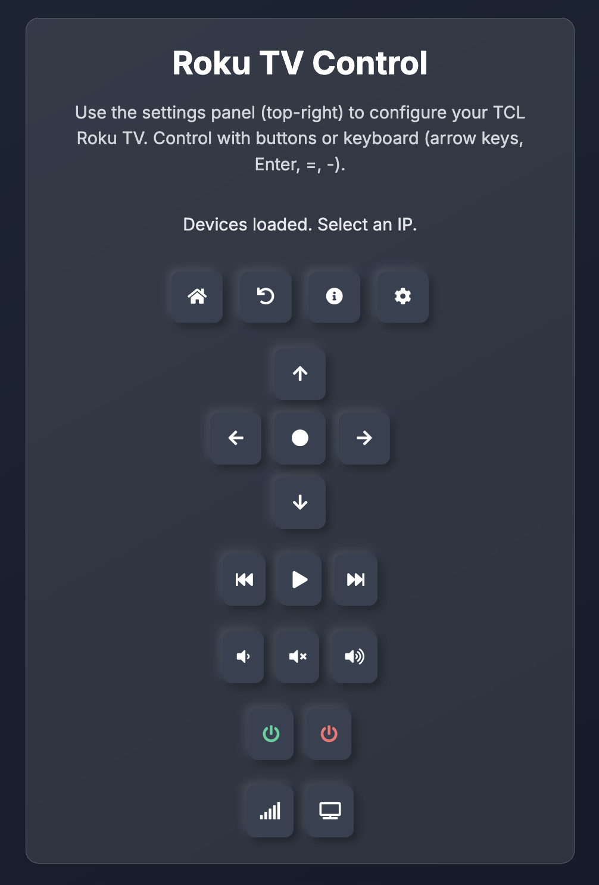

# Roku TV Control

## Overview
Roku TV Control is a web-based application designed to control TCL Roku TVs on your local network. It features a modern, visually appealing interface with icon-based controls, a settings panel for network configuration, and support for both mouse and keyboard inputs. The application supports Progressive Web App (PWA) installation on iOS, Android, and Chrome browsers, enabling a native-like experience. It uses SSDP and HTTP for device discovery and communicates with the TV via HTTP, with backend handling to ensure HTTPS compatibility for secure deployments.

<div align="center">
  
</div>


## Features
- **Intuitive Interface**: A sleek, dark-themed UI with glassmorphism containers, neumorphic buttons, and smooth animations (fade-in, hover scaling, side panel slide).
- **Remote Control**: Control your TCL Roku TV with icon buttons (Home, Back, Up, Down, Play, Volume, Power, etc.) featuring tooltips for accessibility.
- **Keyboard Support**: Use `Arrow keys` for navigation, `Enter` for selection, `=` for Volume Up, `-` for Volume Down, and `Backspace` for Back.
- **Device Discovery**: Automatically discover TCL Roku TVs on the network using SSDP or HTTP scanning, with manual IP entry option.
- **Settings Panel**: Configure subnet and IP via an expandable side panel (toggled via hamburger icon), with status updates.
- **Progressive Web App (PWA)**: Install as a native-like app on iOS, Android, and Chrome browsers, with offline UI access (control requires network).
- **HTTPS Compatibility**: Frontend communicates over HTTPS, with backend handling HTTP requests to the TV, avoiding mixed content issues.
- **Docker Support**: Run the application in a Docker container with `--network host` for SSDP discovery.
- **Responsive Design**: Adapts to mobile and desktop screens, with a collapsible settings panel for smaller devices.


### Device Discovery
- **SSDP Discovery**: Automatically detects TCL Roku TVs on the network using SSDP (Simple Service Discovery Protocol) multicast, binding to the internet-facing network interface for reliable discovery.
- **HTTP Subnet Scanning**: Falls back to scanning a user-specified subnet (e.g., `10.0.3.0`) via HTTP requests if SSDP fails, checking IPs `x.x.x.1` to `x.x.x.255` for TCL Roku TVs.
- **Subnet Selection**: Users can select from predefined subnets (e.g., `10.0.0.0`, `192.168.1.0`) via a dropdown or manually enter a custom subnet (e.g., `10.0.4.0`) in a text input.
- **Persistent Results**: Discovered devices are stored in the browser’s `localStorage` and persist until a new scan is performed, ensuring quick access on page reload.
- **Change Subnet**: After a scan, users can click a "Change Subnet" button to re-display subnet inputs and perform a new scan.

### User Interface
- **Expandable Side Panel**: A sleek, right-aligned side panel contains all settings (subnet dropdown, subnet input, discover button, IP dropdown, change subnet button, manual IP input, and set IP button). It’s expanded by default and collapses after setting an IP.
- **Hamburger Toggle**: A beautiful hamburger icon button in the top-right corner toggles the side panel’s visibility with a smooth CSS transition animation.
- **Responsive Design**: Built with Tailwind CSS, the interface is clean, modern, and responsive, adapting to various screen sizes.
- **IP Selection**: After discovery, a dropdown lists detected TVs (e.g., `TCL Roku TV (10.0.3.100)`). Selecting an IP auto-populates a manual IP input field for confirmation.
- **Status Messages**: A status area provides real-time feedback on discovery, errors, and control actions (e.g., “IP set to 10.0.3.100”, “No TCL Roku TVs found”).

### Remote Control
- **Button Controls**: On-screen buttons allow control of TCL Roku TVs, including:
  - Navigation: Up, Down, Left, Right, Select
  - Functions: Home, Back, Info, Settings
  - Media: Rewind, Play/Pause, Fast Forward
  - Volume: Volume Up, Volume Down, Mute
  - Power: Power On, Power Off
  - Other: Find Remote, Input

- **Keyboard Controls**: Map keyboard keys to remote functions for quick access:
  - Arrow keys: Up, Down, Left, Right
  - Enter: Select
  - `=`: Volume Up
  - `-`: Volume Down
  - Backspace: Back
- **HTTP Commands**: Sends HTTP POST requests to the TV’s API (port 8060) for reliable control (e.g., `http://<IP>:8060/keypress/Up`).

### Deployment
- **Local Setup**: Run the application locally with Python and pip, using a `requirements.txt` for dependency management.
- **Docker Support**: A `Dockerfile` enables containerized deployment, with `--network host` for SSDP multicast compatibility.
- **Network Interface Detection**: The backend uses `netifaces` to bind SSDP to the default gateway’s interface, ensuring discovery works even with multiple network interfaces.

## Prerequisites
- Python 3.9+ (for local setup)
- Docker (for containerized deployment)
- A TCL Roku TV on the same local network
- Network access to port 8060 (for TV control) and 1900 (for SSDP)

## Installation

### Local Setup
1. Clone the repository:
   ```bash
   git clone https://github.com/greko6/tcl_roku_simple_remote.git
   cd roku-tv-control
   ```
2. Install dependencies:
   ```bash
   pip install -r requirements.txt
   ```
3. Run the application:
   ```bash
   python server.py
   ```
4. Open a browser and navigate to `http://localhost:5000`.

### Docker Setup
1. Clone the repository:
   ```bash
   git clone <repository-url>
   cd roku-tv-control
   ```
2. Build the Docker image:
   ```bash
   docker build -t roku-control .
   ```
3. Run the container:
   ```bash
   docker run -p 5000:5000 --network host roku-control
   ```
4. Open a browser and navigate to `http://localhost:5000`.

**Note**: The `--network host` flag is required for SSDP multicast to work correctly. Ensure no other services are using port 5000.

## Usage
1. **Open the Application**:
   - Access `http://localhost:5000` in your browser.
2. **Configure Settings**:
   - The side panel is expanded by default, showing the settings.
   - Select a subnet from the dropdown (e.g., `10.0.3.0`) or enter a custom subnet (e.g., `10.0.4.0`) in the input field.
   - Click “Discover TVs” to scan for TCL Roku TVs using SSDP and HTTP (if needed).
3. **Select IP**:
   - After discovery, choose a TV from the IP dropdown. The selected IP auto-populates the manual IP field.
   - Click “Set IP” to lock in the TV’s IP. The side panel collapses automatically.
4. **Control the TV**:
   - Use the on-screen buttons or keyboard controls to navigate, adjust volume, play media, or power the TV on/off.
   - Example: Press `=` for Volume Up, `-` for Volume Down, or arrow keys for navigation.
5. **Toggle Settings**:
   - Click the hamburger icon (top-right) to expand/collapse the side panel for further configuration.
   - Use the “Change Subnet” button to scan a different subnet if needed.
6. **Status Feedback**:
   - Monitor the status area for messages about discovery success, errors, or control actions.
7. **Install as PWA** (Note: SSL cert required, use reverse proxy):
   - **Chrome (Desktop/Android)**:
     - Open the app in Chrome.
     - Click the “+” icon in the address bar or the “Install” prompt.
     - Choose “Install” to add to desktop or home screen.
   - **iOS Safari**:
     - Open the app in Safari.
     - Tap the “Share” icon.
     - Select “Add to Home Screen” and confirm.
   - The app appears as “Roku Control” with the custom icon, launching in standalone mode.

## File Structure
- `server.py`: Flask backend handling SSDP and HTTP discovery, serving the frontend.
- `roku_control.html`: Frontend with Tailwind CSS, JavaScript, and the side panel interface.
- `requirements.txt`: Python dependencies (Flask, netifaces, requests).
- `Dockerfile`: Instructions for building a Docker image.

## Troubleshooting
- **No Devices Found**:
  - Verify the TV’s IP (Settings > Network > About on the TV) and ensure it matches the subnet.
  - Check that port 8060 is open and the TV is on the same network.
  - Ensure no firewall blocks port 1900 (SSDP) or 8060 (HTTP).
- **SSDP Fails**:
  - Confirm the backend binds to the correct interface (check logs in `server.py`).
  - Close other applications using port 1900 (e.g., UPnP services).
- **Docker Issues**:
  - Use `--network host` to ensure SSDP multicast works.
  - Check for port conflicts on 5000 or 1900.
- **Subnet Errors**:
  - Ensure the subnet ends in `.0` (e.g., `10.0.3.0`). Invalid formats are caught by the frontend.
- **Logs**:
  - Backend logs (`server.py`) provide detailed information on discovery and errors. Run with `python server.py` to view them.

## Contributing
Contributions are welcome! Please:
1. Fork the repository.
2. Create a feature branch (`git checkout -b feature-name`).
3. Commit changes (`git commit -m 'Add feature'`).
4. Push to the branch (`git push origin feature-name`).
5. Open a pull request.

## License
This project is licensed under the MIT License. See the `LICENSE` file for details.
